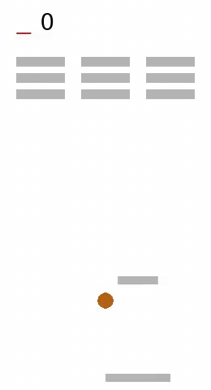

# Imitation-Learning-over-Heterogeneous-Agents-with-Restraining-Bolts
Analysis and implementation of a modified training environment from the paper ["Imitation Learning over Heterogeneous Agents with Restraining Bolts."](https://www.dis.uniroma1.it/~degiacom/papers/2020/icaps2020dfip.pdf) (De Giacomo et all, 2020). The present project  consist on a modification of the [code](https://github.com/whitemech/Imitation-Learning-over-Heterogeneous-Agents-with-Restraining-Bolts) from the reference paper.

> "A common problem in Reinforcement Learning (RL) is that the reward function is hard to express. This can be overcome by resorting to Inverse Reinforcement Learning (IRL), which consists in first obtaining a reward function from a set of execution traces generated by an expert agent, and then making the learning agent learn the expert’s behavior –this is known as Imitation Learning (IL). Typical IRL solutions rely on a numerical representation of the reward function, which raises problems related to the adopted optimization procedures. We describe an IL method where the execution traces generated by the expert agent, possibly via planning, are used to produce a logical (as opposed to numerical) specification of the reward function, to be incorporated into a device known as Restraining Bolt (RB). The RB can be attached to the learning agent to drive the learning process and ultimately make it imitate the expert. We show that IL can be applied to heterogeneous agents, with the expert, the learner and the RB using different representations of the environment’s actions and states, without specifying mappings among their representations." 

*Work done for the subject Reasoning Agents of the branch of artificial intelligence in the MSc. Artificial Intelligence and Robotics 2020 in times of coronavirus.*

- Giulia Cassarà
- Ivan Colantoni
- Fabian Fonseca
- Damiano Zappia

## Modified environmentBreakout 
The environment had a set four modifications in order to stress the *boundaries* of the implementation: Vertical movement ofthe bricks, horizontal movements of the bricks, movement of the bricks around the plane and the inclusion of the front paddle.

The combination of those modifications presented three new study cases in which the *state space gap increases and the robustness of the implementation is tested*.

### Vertical movement with frontal paddle
The vertical movement of the bricks and the addition of a front paddle have no influence on the functioning of the expert agent, but they considerably modify the behavior of the learner agent since now is capable to **cooperate** with the front paddle to get more reward.




### Horizontal movement with frontal paddle
The Horizontal movement of the bricks increase to a *medium level* the difficulty for the expert agent, but the learner agent remains stable in cooperation.


### Plane movement with frontal paddle
The plane movement of the bricks *peaked the difficulty* for the expert agent since now is not able to finish the task due to *resonance phenomena*. Nevertheless, the traces obtained from the failed expert are able to generate a DFA that guide the lerner agent to a successful behavior.


## Setup
Set your virtual environment up:
```
pipenv --python=python3.7
```
    
Install the dependencies in the main directory:
```
pipenv install
```

## How to run
Activate the virtual environment in the current shell:
```
pipenv shell
```

And execute the code
```
python3 -m breakout --rows 3 --cols 3
    --output-dir experiments/breakout-output
    --overwrite 
```

## References
- [1] De Giacomo, Giuseppe, et al. “Imitation Learning over Heterogeneous Agents with Restraining Bolts.” Association for the Advancement of Artificial Intelligence. 2020.
- [2] Gaon, Brafman. “Reinforcement Learning with Non-Markovian Rewards.” Association for the Advancement of Artificial Intelligence. 2020.
